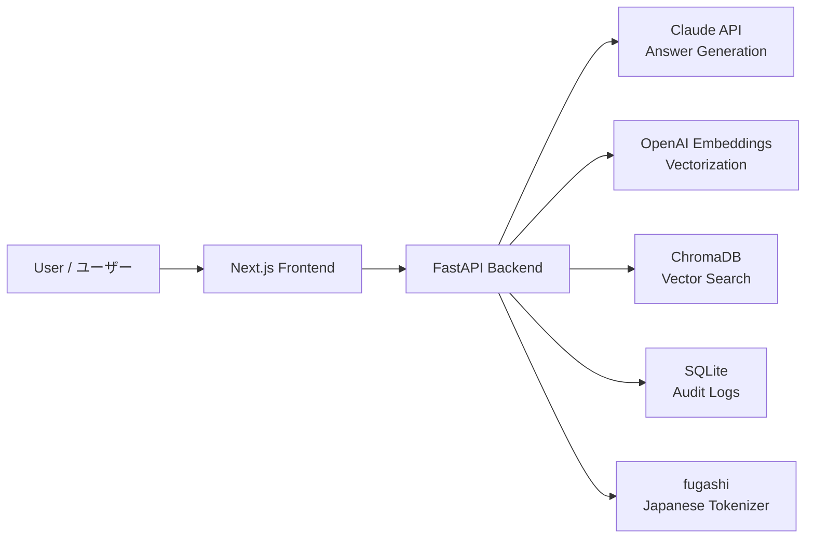

# 社内ナレッジ検索 / Internal Knowledge Search / 企业内部知识检索

> RAGベースの社内ドキュメント検索・質問応答システム
>
> A RAG-based internal document search and Q&A system for enterprise knowledge management.
>
> 基于RAG的企业内部文档检索与智能问答系统

[日本語](#日本語) | [English](#english) | [中文](#中文)

---

## Architecture / アーキテクチャ / 系统架构



---

## 日本語

### 機能一覧

#### コア機能
- **ドキュメントアップロード** — PDF、Word (.docx)、テキスト、Markdown対応
- **日本語チャンキング** — fugashiによる形態素解析ベースの意味的分割
- **ベクトル検索** — OpenAI Embeddings + ChromaDBによるセマンティック検索
- **AI質問応答** — Claude APIによる出典付き回答生成
- **マルチターン会話** — 文脈を保持した連続質問

#### 高度な機能
- **部署別アクセス制御** — 部署ごとのドキュメント閲覧範囲の制御（営業部・技術部・人事部 等）
- **信頼度スコア** — 回答ごとの確信度を0-100%で表示
- **自動分類** — アップロード時に文書タイプを自動判定（議事録・技術資料・規程 等）
- **検索監査ログ** — 全検索履歴の記録・閲覧
- **キーワードハイライト** — 出典テキスト内の関連キーワードを黄色で強調表示
- **パンくずリスト** — 企業システム標準のナビゲーション
- **ヘルプツールチップ** — 各機能の使い方をホバーで表示

### クイックスタート

#### 前提条件
- Python 3.9+
- Node.js 18+
- Anthropic API キー
- OpenAI API キー

#### バックエンド起動

```bash
cd backend
python -m venv venv
source venv/bin/activate
pip install -r requirements.txt

cp ../.env.example .env
# .env ファイルにAPIキーを設定してください

uvicorn app.main:app --reload --port 8000
```

#### フロントエンド起動

```bash
cd frontend
npm install
npm run dev
```

http://localhost:3000 でアクセスできます。

---

## English

### Features

#### Core
- **Document Upload** — PDF, Word (.docx), TXT, Markdown supported
- **Japanese Chunking** — Morphological analysis with fugashi for accurate text segmentation
- **Semantic Search** — Vector similarity search via OpenAI embeddings + ChromaDB
- **AI Q&A with Citations** — Claude-powered answers with source document references
- **Multi-turn Conversation** — Context-aware follow-up questions

#### Advanced
- **Department-based Access Control** — Document visibility scoped by department (Sales, Engineering, HR, etc.)
- **Confidence Score** — 0-100% reliability indicator per answer
- **Auto Classification** — Automatic document categorization on upload
- **Search Audit Log** — Full history of queries, answers, and sources
- **Keyword Highlighting** — Visual highlighting of matched terms in source citations
- **Breadcrumb Navigation** — Enterprise-standard page navigation
- **Help Tooltips** — Contextual guidance on hover for each feature

### Quick Start

#### Prerequisites
- Python 3.9+
- Node.js 18+
- Anthropic API key
- OpenAI API key

#### Backend

```bash
cd backend
python -m venv venv
source venv/bin/activate
pip install -r requirements.txt

cp ../.env.example .env
# Edit .env with your API keys

uvicorn app.main:app --reload --port 8000
```

#### Frontend

```bash
cd frontend
npm install
npm run dev
```

Open http://localhost:3000

---

## 中文

### 功能列表

#### 核心功能
- **文档上传** — 支持 PDF、Word (.docx)、TXT、Markdown
- **日语语义分块** — 基于 fugashi 形态素分析的智能文本切分
- **向量检索** — OpenAI Embeddings + ChromaDB 语义搜索
- **AI智能问答** — Claude API 生成带出处引用的回答
- **多轮对话** — 支持上下文记忆的连续提问

#### 高级功能
- **部门权限管理** — 按部门控制文档可见范围（营业部、技术部、人事部等）
- **置信度评分** — 每个回答附带 0-100% 的可信度指标
- **自动分类** — 上传时自动识别文档类型（会议记录、技术资料、规程等）
- **搜索审计日志** — 完整记录所有搜索历史
- **关键词高亮** — 在引用原文中高亮显示匹配关键词
- **面包屑导航** — 企业系统标准导航组件
- **帮助提示** — 悬停显示各功能说明

### 快速开始

#### 前置条件
- Python 3.9+
- Node.js 18+
- Anthropic API Key
- OpenAI API Key

#### 启动后端

```bash
cd backend
python -m venv venv
source venv/bin/activate
pip install -r requirements.txt

cp ../.env.example .env
# 在 .env 文件中填入 API Key

uvicorn app.main:app --reload --port 8000
```

#### 启动前端

```bash
cd frontend
npm install
npm run dev
```

访问 http://localhost:3000

---

## Tech Stack / 技術スタック / 技术栈

| Layer | Technology |
|-------|-----------|
| **Frontend** | Next.js 16 (App Router), TypeScript, Tailwind CSS, shadcn/ui, Noto Sans JP |
| **Backend** | Python, FastAPI, SQLAlchemy, aiosqlite |
| **LLM** | Anthropic Claude API (claude-sonnet-4-20250514) |
| **Embedding** | OpenAI text-embedding-3-small |
| **Vector DB** | ChromaDB |
| **NLP** | fugashi + unidic-lite (Japanese morphological analysis) |

## Project Structure / プロジェクト構成

```
shanai-knowledge-search/
├── backend/
│   ├── app/
│   │   ├── main.py              # FastAPI entry point
│   │   ├── config.py            # Environment configuration
│   │   ├── database.py          # Async SQLAlchemy setup
│   │   ├── models/
│   │   │   └── schemas.py       # ORM models + Pydantic schemas
│   │   ├── routers/
│   │   │   ├── documents.py     # Document CRUD + department filter
│   │   │   ├── search.py        # RAG search & Q&A
│   │   │   └── logs.py          # Audit log endpoint
│   │   └── services/
│   │       ├── chunker.py       # Japanese text chunking (fugashi)
│   │       ├── document.py      # File parsing + auto classification
│   │       ├── embedding.py     # Vector embedding & ChromaDB
│   │       └── llm.py           # Claude API integration
│   └── requirements.txt
├── frontend/
│   └── src/
│       ├── app/
│       │   ├── page.tsx         # Search & chat interface
│       │   ├── documents/       # Document management page
│       │   └── logs/            # Search audit logs page
│       ├── components/
│       │   ├── sidebar.tsx      # Navigation + department selector
│       │   ├── breadcrumb.tsx   # Breadcrumb navigation
│       │   ├── help-tip.tsx     # Help tooltip component
│       │   └── providers.tsx    # Context providers
│       └── lib/
│           ├── api.ts           # API client
│           ├── highlight.tsx    # Keyword highlighting utility
│           └── department-context.tsx  # Department state management
├── .env.example
├── .gitignore
└── LICENSE
```

## API Endpoints

| Method | Path | Description |
|--------|------|-------------|
| `GET` | `/api/health` | Health check / ヘルスチェック |
| `GET` | `/api/documents/departments` | List departments / 部署一覧 |
| `POST` | `/api/documents` | Upload document / ドキュメントアップロード |
| `GET` | `/api/documents?department=技術部` | List documents (filtered) / ドキュメント一覧 |
| `DELETE` | `/api/documents/:id` | Delete document / ドキュメント削除 |
| `POST` | `/api/search` | RAG search & Q&A / 検索・質問応答 |
| `GET` | `/api/logs` | Search audit logs / 検索ログ一覧 |

## License

MIT
